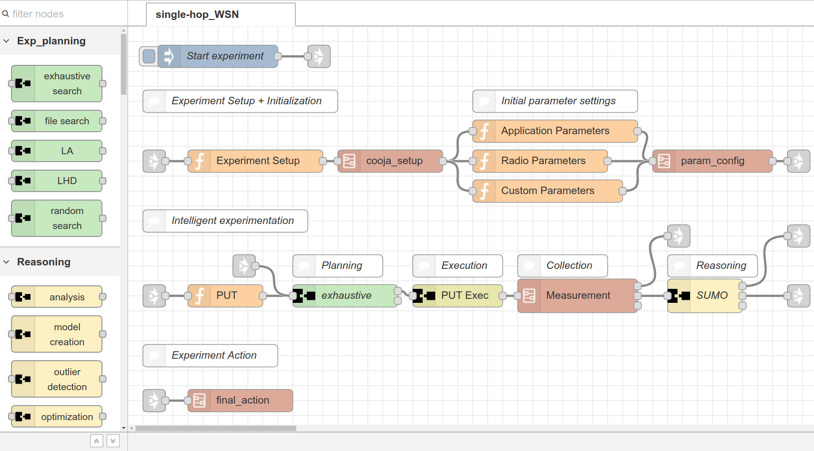

# Node-RED Framework

This is a Node-RED based wireless experimentation framework used in the [eWINE project](https://ewine-project.eu/). It lists different Node-RED modules and experimentation flows that are used to solve wireless network problems.

## Node-RED Modules

The Node-RED modules built are used for intelligent wireless experimentation and they are categorized into planning, reasoning and miscellaneous nodes

### Planning Modules
[exhaustive-search](node-red-ewine/planning-exhaustive-search): plans an experiment at each and every parameter settings  
[file-search](node-red-ewine/planning-file-search): plans an experiment at selective parameter settings given by a file  
[LA](node-red-ewine/planning-LA): experiment planning using Locating Array (LA) Design  
[LHD](node-red-ewine/planning-LHD): experiment planning using Latin Hypercube Design (LHD)  
[random-search](node-red-ewine/planning-random-search): random experiment planning from the parameter design space

### Reasoning Modules
[analysis](node-red-ewine/reasoning-analysis): statistical analysis reasoning block  
[model-creation](node-red-ewine/reasoning-model-creation): builds an accurate surrogate model of a black box system  
[optimization](node-red-ewine/reasoning-optimization): optimizes a black box system using surrogate models

### Miscellaneous Modules
[Cooja](node-red-ewine/miscellaneous-cooja): starts a cooja network simulator from [contiki](http://www.contiki-os.org/)  
[js2xml](node-red-ewine/miscellaneous-js2xml): renders json string into xml format  
[Mfile](node-red-ewine/miscellaneous-Mfile): Writes/Reads multiple messages to/from multiple files  
[split_WI](node-red-ewine/miscellaneous-split_WI): Split a message into multiple messages and send them with interval.  
[tcpClient](node-red-ewine/miscellaneous-tcpClient): sends TCP request messages to a server  
[UPI_exec](node-red-ewine/miscellaneous-UPI_exec): communicates to a WISHFUL enabled controller using Universal Programming Interface (UPI)

## Node-RED flows

All Node-RED flows that are described here follow similar experimentation flow. There are three basic sub parts which are used for I) experiment setup and initialization II) intelligent experimentation and III) experiment action. Figure 1 shows the detail.

*Figure 1. Node-RED experimentation flow*

[flows_WSN](flows_WSN.json): A Wireless Sensor Network demonstrator flow  
[flows_PL](flows_PL.json): A Path Loss calculator flow  
[flows_Wi-Fi_conf_OPT](flows_Wi-Fi_conf_OPT.flow): Wi-Fi conference optimization flow  
[flows_DYN](flows_DYN.json): A dynamic WSN optimization flow

## Contact

michael.mehari@ugent.be
